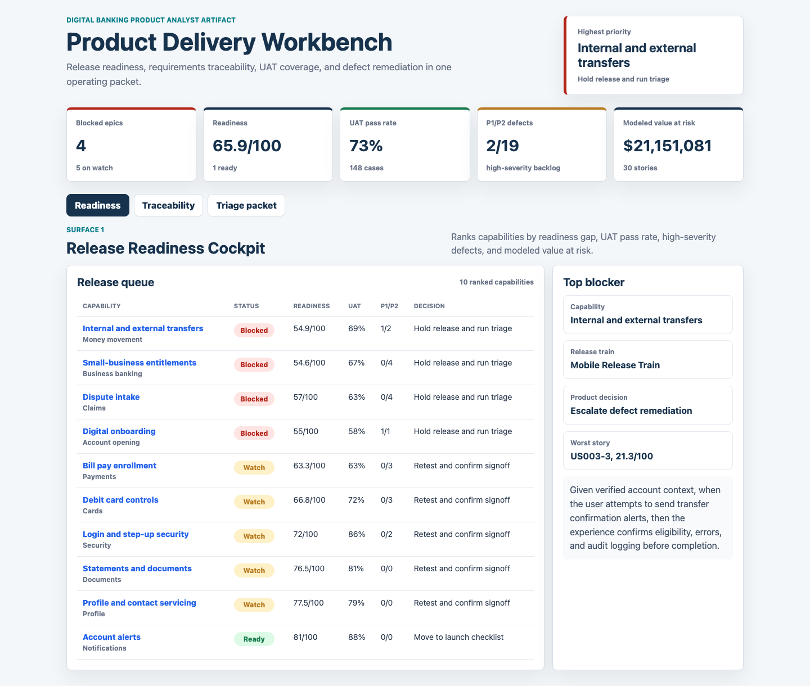
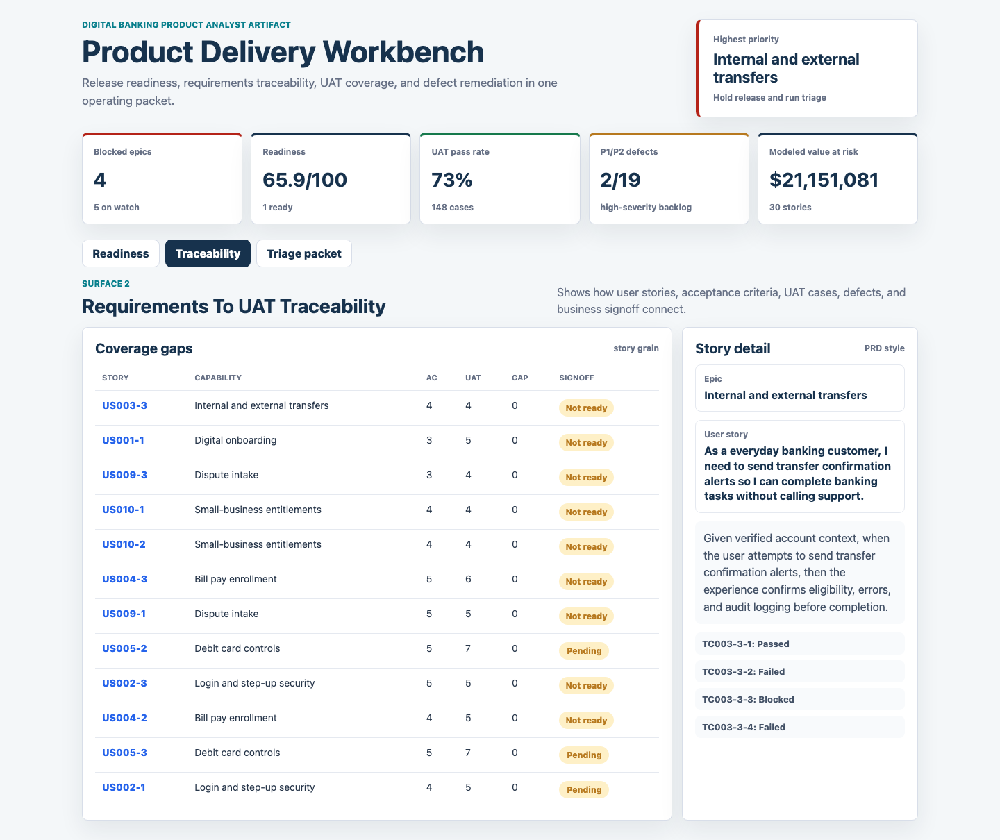
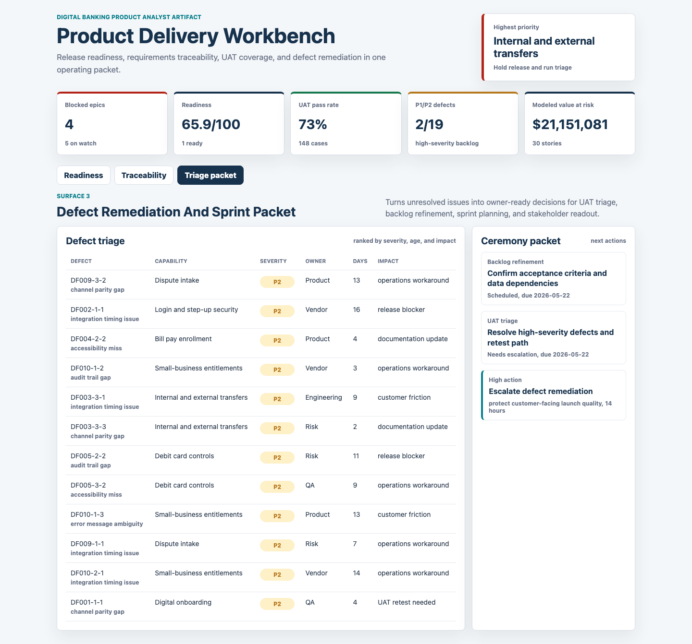

# Digital Banking Product Delivery Workbench

This portfolio artifact is a product analyst operating packet for a digital banking delivery team. It connects requirements, user stories, acceptance criteria, UAT validation, defect remediation, sprint ceremonies, OKR metrics, and release-readiness decisions.

The project is built around a practical product question: which digital banking capabilities are ready for release, which need UAT or defect remediation, and what should the product analyst bring to the next sprint or stakeholder review?

## Screenshots



**Release readiness cockpit:** Ranks banking capabilities by readiness score, UAT pass rate, high-severity defects, and modeled value at risk so a product owner can make a go, hold, or retest decision.



**Requirements traceability:** Shows how user stories, acceptance criteria, UAT cases, defect exposure, and business signoff connect at story grain.



**Defect and sprint packet:** Converts open issues into owner-ready decisions for UAT triage, backlog refinement, sprint planning, and release signoff.

## What This Demonstrates

- Translating business needs into user stories and testable acceptance criteria.
- Maintaining requirements to UAT traceability.
- Supporting Agile ceremonies with a decision-ready sprint packet.
- Tracking UAT status, defect severity, business signoff, and release readiness.
- Communicating product risk in business terms for product owners, technology teams, QA, operations, and stakeholders.

## Data Strategy

The data is synthetic because real banking product backlogs, UAT scripts, defect logs, and sprint artifacts are confidential. The generator uses a fixed random seed and models common digital banking structures:

- Product capabilities across onboarding, login and security, transfers, bill pay, card controls, alerts, statements, profile servicing, dispute intake, and small-business entitlements.
- User stories with personas, acceptance criteria counts, data dependencies, grooming quality, UAT pass rate, defect exposure, and signoff status.
- UAT cases with channel, owner, last run date, and passed, failed, or blocked status.
- Defects with severity, owner, status, days open, workflow impact, and triage score inputs.
- Sprint ceremonies and recommended actions for backlog refinement, UAT triage, sprint planning, and release signoff.

The synthetic scoring is explainable, not predictive. User-story readiness is weighted by UAT pass rate, test coverage, grooming score, acceptance quality, requirement risk, and high-severity defects. Epic release priority combines readiness gap, defect severity, coverage gap, and modeled value at risk.

## Analysis Outputs

- `analysis/outputs/release_readiness.csv`: Ranked epic-level release queue.
- `analysis/outputs/requirements_traceability.csv`: Story-level coverage and signoff gaps.
- `analysis/outputs/defect_triage.csv`: Ranked defect remediation queue.
- `analysis/outputs/summary.json`: Portfolio metrics used by the app.
- `analysis/executive_findings.md`: Interview-ready findings and recommendation.
- `analysis/sql_checks.sql`: Example SQL checks for release readiness, traceability gaps, and defect triage.

## Scope

This artifact does not claim to represent real bank performance. It is a realistic, reproducible simulation of the work a digital product analyst performs while supporting digital banking product teams.

It is useful for showing delivery judgment, requirements discipline, UAT thinking, defect triage, and stakeholder communication. It is not a production backlog system, test management platform, or source-of-record for release approvals.

## Run Locally

```bash
python3 -m http.server 4173
```

Then open `http://localhost:4173`.

To regenerate the data:

```bash
python3 scripts/score_operating_data.py
```
